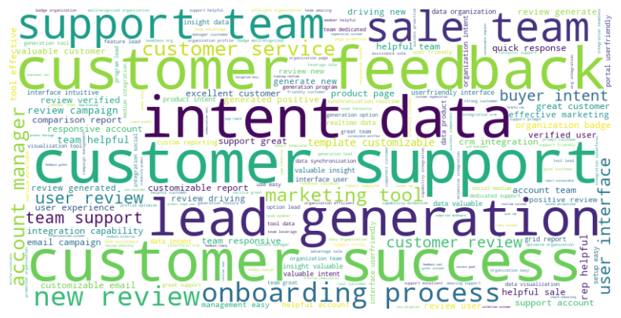
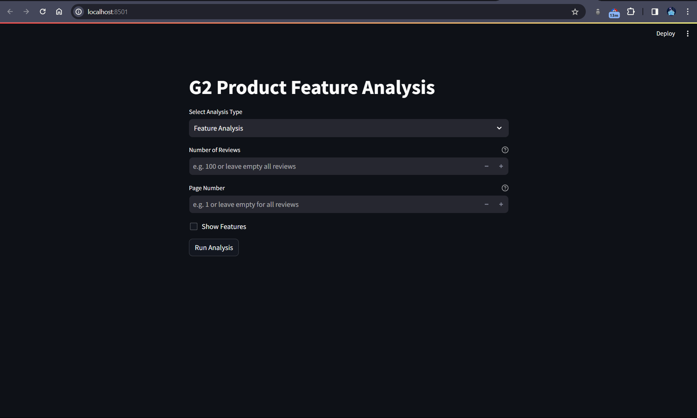
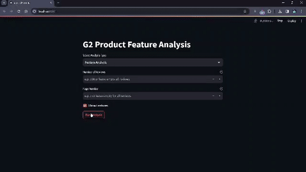
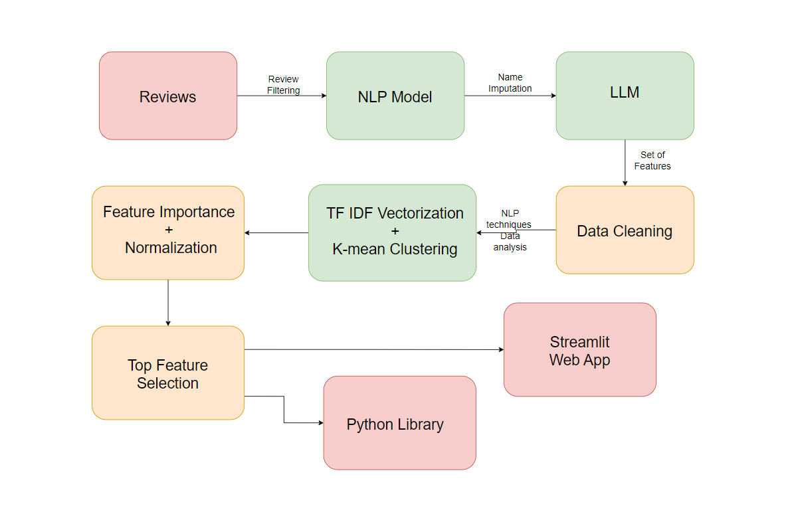

# Review Analysis System

The project involves analyzing product reviews from the G2 platform to extract and identify key features mentioned by users. The aim is to provide insights into what customers are saying about various products and services.

The G2 Product Feature Analysis project offers both a library for seamless integration into existing workflows and a GUI-based Streamlit web application for intuitive visualization.

The library provides easy-to-use functions for extracting and analyzing product features from user reviews, utilizing Natural Language Processing (NLP) techniques and machine learning algorithms. It allows developers to seamlessly integrate feature analysis capabilities into their applications.

Additionally, the Streamlit web application offers a user-friendly interface for visualizing the results of feature analysis. Users can interactively explore the top features extracted from the reviews and gain insights into the most prominent aspects of their products.

Together, these components enable efficient and insightful analysis of product features, empowering businesses to make data-driven decisions to enhance their offerings.


## Results Screenshots
Word clouds generated from product reviews help identify the most prominent features or aspects mentioned by users, facilitating feature analysis and understanding customer sentiment towards specific product attributes. 




Streamlit Application





Demo




Methodology




## Run Locally

Clone the project

```bash
   https://github.com/architanand95/Gr_review_ananlysis.git
```

Go to the project directory


```bash
  cd G2-Hackathon
```

**Environment Variables** : Create a .env file with your G2 API token

Install dependencies

```bash
  pip install -r requirements.txt
```

Start the server

```bash
  streamlit run app.py
```


## Features


* **Feature Analysis**: Analyzes product features mentioned in reviews and identifies their importance using clustering algorithms.
* **Geographic Analysis**: Filters reviews based on the specified country name and analyzes the features mentioned.
* **Time Series Analysis**: Filters reviews based on the specified date and analyzes the features mentioned over time.

## Usage

Alternatively, you can explore and run the provided Jupyter notebooks:

- **g2-hackathon.ipynb**: Works with the entire dataset.
- **g2-hackathon-lite.ipynb** : Works with only 100 reviews.

## API Reference

### G2 API

- **Endpoint:** [https://data.g2.com/api/v1/survey-responses](https://data.g2.com/api/v1/survey-responses)
- **Authentication:** Token-based authentication using the API key.

| Parameter          | Type     | Description                                       |
| :----------------- | :------- | :------------------------------------------------ |
| `api_key`          | `string` | **Required**. Your G2 API key.                   |
| `number_of_reviews`| `integer`| Number of reviews to fetch (default is 10).        |
| `page_num`         | `integer`| Page number of reviews to fetch (default is 1).   |

### Hugging Face API

- **Model:** [Mistral-7B-Instruct-v0.2](https://api-inference.huggingface.co/models/mistralai/Mistral-7B-Instruct-v0.2)
- **Authentication:** Bearer token authentication.

| Parameter    | Type     | Description                                            |
| :----------- | :------- | :----------------------------------------------------- |
| `inputs`     | `string` | **Required**. The review text to analyze.             |
| `temperature`| `float`  | Control the randomness of the outputs (default is 0.9).|

## Methods

In the dump folder, various failed attempts are documented:
- Initially, data analytics techniques were employed to extract features, but encountered numerous false positives.
- Subsequently, NLP techniques were explored, but proved ineffective in extracting features accurately.
- Recognizing the need for contextual attention models, integration of Large Language Models (LLMs) commenced. Initially, models such as Phi Dolphin Phi and Orca Mini (2B parameter models) were tested but yielded unsatisfactory results.
- Transitioning to more powerful models, attempts were made with Gemma and Mistral (7B parameter models), leading to system crashes. Consequently, Mistral 7B v2 model API was adopted for the project.

Direct transmission of data to the Mistral API was not viable due to sensitive information such as company and personal names. As a solution, Spacy library was utilized for name imputation, followed by extraction of user-preferred features. Post preprocessing, TFIDF vectorization segmented the features into clusters based on semantic similarity. Subsequently, feature importance was determined for each cluster using term frequency and normalization techniques. The top features from each cluster were selected as representative features.

## Tech Stack

- Python: Core programming language for development.
- Streamlit: Frontend framework used for building interactive web applications.
- Requests: HTTP library for making API requests.
- Spacy: Natural Language Processing (NLP) library for text processing.
- NLTK: NLP library for tokenization, stemming, and other text processing tasks.
- Scikit-learn: Machine learning library for clustering and feature extraction.
- Matplotlib: Data visualization library for creating plots and charts.
- WordCloud: Library for generating word clouds based on text data.
- dotenv: Library for loading environment variables from a .env file.


